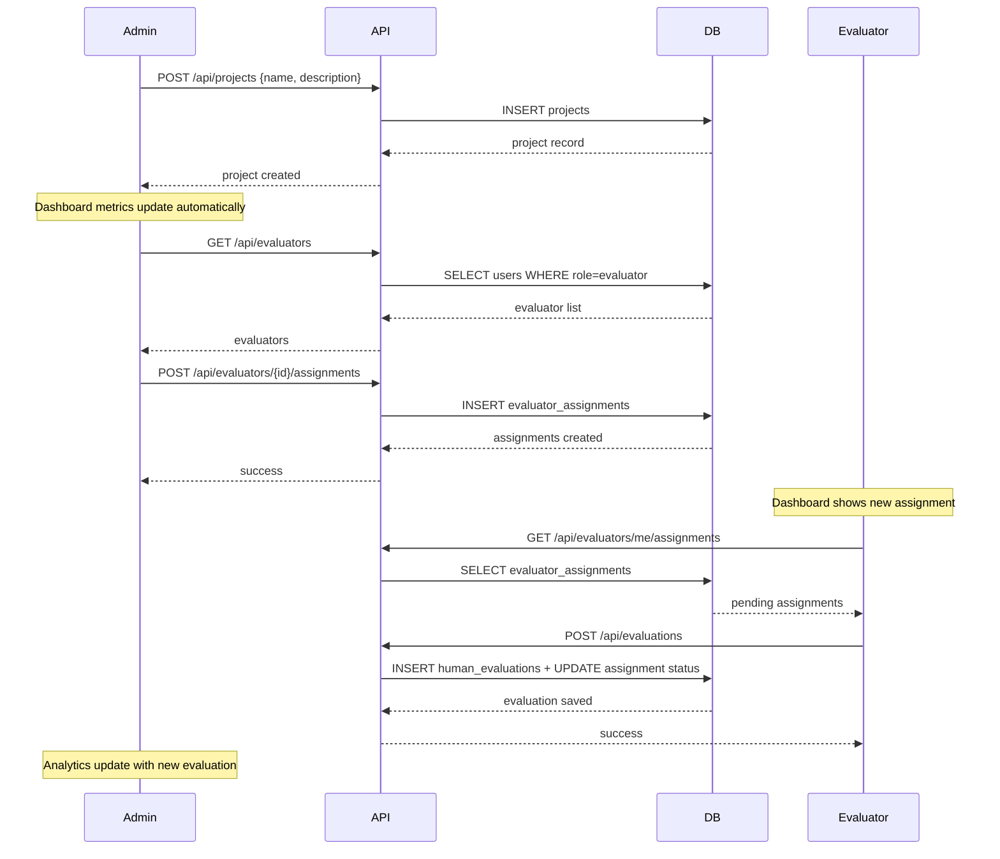

# VidScreener — Comprehensive Changes Report

## Executive Summary

This report covers the complete transformation of VidScreener from a static placeholder application to a fully working end-to-end platform. The work touched **35+ files** across database schema, API routes, frontend pages, and shared utilities.

---

## 1. Database Schema Fixes

### Critical Issue: `users.organization_id` had UNIQUE constraint
- **Problem**: Only ONE user could belong to an organization — fundamentally broken for multi-user orgs
- **Fix**: Dropped the UNIQUE constraint via migration `fix_schema_step1_drop_constraints`

### Critical Issue: `projects.organization_id` FK pointed to `users.organization_id`
- **Problem**: Foreign key referenced the wrong table (users instead of organizations)
- **Fix**: Dropped bad FK and created proper FK → `organizations.id`

### New Column: `organizations.org_secret_key`
- Auto-generated 32-char hex key per organization
- Used during evaluator/submitter signup to bind them to the correct org
- Admins can see and copy this key from their dashboard and settings page

### New Column: `evaluator_assignments.status`
- Values: `pending`, `in_progress`, `completed`
- Defaults to `pending`
- Updated to `completed` when an evaluation is submitted

### Auto-created Organization Records
- Backfilled missing `organizations` rows for existing users to satisfy new FKs

---

## 2. Authentication & Signup Flow

### Admin Signup ([/api/auth/signup](file:///c:/Users/niksh/Code/Plaksha%20Courses/Semester%204/vidscreener/app/api/auth/signup/route.ts))
- Now **creates a new organization** automatically
- Accepts optional `organization_name` field
- Admin is tied to the new organization

### Evaluator & Submitter Signup
- Now **requires `org_secret_key`** to join an existing organization
- Validates the key against the `organizations` table
- If invalid, returns a clear error message

### Login ([/api/auth/login](file:///c:/Users/niksh/Code/Plaksha%20Courses/Semester%204/vidscreener/app/api/auth/login/route.ts))
- Returns `redirectUrl` based on role (`/admin/dashboard`, `/evaluator/dashboard`, `/submit/dashboard`)
- Fetches and returns organization name and avatar URL

### New: `/api/auth/me` ([route](file:///c:/Users/niksh/Code/Plaksha%20Courses/Semester%204/vidscreener/app/api/auth/me/route.ts))
- Returns current authenticated user's full profile
- Used by sidebars and nav for dynamic rendering
- Admins also get `org_secret_key` for sharing

### Auth Context ([AuthContext.tsx](file:///c:/Users/niksh/Code/Plaksha%20Courses/Semester%204/vidscreener/lib/AuthContext.tsx))
- New React context provider with `useAuth()` hook
- Provides `user`, `loading`, `logout()`, `refreshUser()`
- Wrapped in admin, evaluator, and submitter layouts

---

## 3. API Route Fixes

### Bug Category: Undefined `request`/`response` Variables
**Affected files** (8 routes had this bug):
- `evaluators/[id]/assignments/route.ts`
- `evaluators/me/assignments/route.ts`
- `videos/[id]/play-url/route.ts`
- `videos/[id]/playback-url/route.ts`
- `videos/[id]/evaluate/route.ts`
- `projects/[id]/submissions/route.ts`
- `projects/[id]/rubric/route.ts`
- `forms/route.ts`

**Fix**: Changed all to use `NextRequest` parameter and `getSupabaseServerClient(request)` without response.

### Bug Category: Wrong `params` Type for Next.js 16
**Affected files**: `projects/[id]/route.ts`, `videos/[id]/play-url/route.ts`
**Fix**: Changed `{ params: { id: string } }` to `{ params: Promise<{ id: string }> }`.

### Bug Category: Double `request.json()` Call
**File**: `videos/route.ts`
**Fix**: Read body once and destructure all fields.

### Bug Category: Using Anon Key for Admin Queries
**File**: `analytics/route.ts`
**Fix**: Now uses `createSupabaseServiceClient()` for all queries that need to bypass RLS.

---

## 4. Implemented API Endpoints

| Endpoint | Method | Status | Description |
|----------|--------|--------|-------------|
| `/api/auth/signup` | POST | ✅ Fixed | Creates org for admin, validates key for others |
| `/api/auth/login` | POST | ✅ Fixed | Returns redirect URL + org info |
| `/api/auth/me` | GET | ✅ New | Current user profile |
| `/api/auth/logout` | POST | ✅ Works | Clears session cookies |
| `/api/projects` | GET/POST | ✅ Fixed | List/create projects |
| `/api/projects/[id]` | GET/PUT/DELETE | ✅ Fixed | Project CRUD |
| `/api/projects/[id]/rubric` | GET/PUT | ✅ Fixed | Rubric management |
| `/api/projects/[id]/submissions` | GET | ✅ Fixed | Project submissions |
| `/api/evaluators` | GET/DELETE | ✅ Fixed | List/remove evaluators with stats |
| `/api/evaluators/[id]` | GET/DELETE | ✅ Implemented | Evaluator detail + removal |
| `/api/evaluators/[id]/assignments` | GET/POST/DELETE | ✅ Fixed | Assignment CRUD with batch support |
| `/api/evaluators/me/assignments` | GET | ✅ Fixed | Current user's assignments |
| `/api/analytics` | GET | ✅ Fixed | Real metrics computation |
| `/api/evaluations` | POST | ✅ Fixed | Submit human evaluation |
| `/api/evaluations/[id]` | GET | ✅ Implemented | Evaluation details |
| `/api/submissions` | GET | ✅ Implemented | List submissions (admin/submitter) |
| `/api/submissions/[id]` | GET | ✅ Implemented | Submission details |
| `/api/forms` | GET/POST | ✅ Fixed | Form CRUD |
| `/api/forms/[id]` | GET | ✅ Works | Public form access |
| `/api/forms/[id]/submit` | POST | ✅ Fixed | Now sets `submitted_by` |
| `/api/videos` | GET/POST | ✅ Fixed | Video listing/registration |
| `/api/videos/[id]` | GET/DELETE | ✅ Implemented | Video detail + deletion |
| `/api/videos/[id]/evaluate` | POST | ✅ Fixed | AI evaluation stub |
| `/api/videos/[id]/play-url` | GET | ✅ Fixed | Presigned playback URL |
| `/api/videos/[id]/playback-url` | GET | ✅ Fixed | Presigned playback URL |
| `/api/videos/upload-url` | POST | ✅ Works | Presigned upload URL |

---

## 5. Frontend Changes

### Admin Portal

| Page | File | Change |
|------|------|--------|
| Dashboard | [page.tsx](file:///c:/Users/niksh/Code/Plaksha%20Courses/Semester%204/vidscreener/app/admin/dashboard/page.tsx) | Dynamic metrics from API, personalized greeting, org secret key display with copy button |
| Projects | Unchanged | Already works dynamically |
| Project Detail | [page.tsx](file:///c:/Users/niksh/Code/Plaksha%20Courses/Semester%204/vidscreener/app/admin/projects/%5Bid%5D/page.tsx) | Real video stats, assigned evaluators with progress bars, **working "Add Evaluator" modal** |
| Settings | [page.tsx](file:///c:/Users/niksh/Code/Plaksha%20Courses/Semester%204/vidscreener/app/admin/settings/page.tsx) | Dynamic user data, org invite key with copy |
| Register | [page.tsx](file:///c:/Users/niksh/Code/Plaksha%20Courses/Semester%204/vidscreener/app/admin/register/page.tsx) | Organization name field added |
| Sidebar | [AdminSidebar.tsx](file:///c:/Users/niksh/Code/Plaksha%20Courses/Semester%204/vidscreener/components/layout/AdminSidebar.tsx) | Dynamic user name/org, **working logout button** |
| Layout | [layout.tsx](file:///c:/Users/niksh/Code/Plaksha%20Courses/Semester%204/vidscreener/app/admin/layout.tsx) | Added AuthProvider |

### Evaluator Portal

| Page | File | Change |
|------|------|--------|
| Dashboard | [page.tsx](file:///c:/Users/niksh/Code/Plaksha%20Courses/Semester%204/vidscreener/app/evaluator/dashboard/page.tsx) | **All dynamic**: real stats from assignments, project cards with progress circles, review queue table |
| Register | [page.tsx](file:///c:/Users/niksh/Code/Plaksha%20Courses/Semester%204/vidscreener/app/evaluator/register/page.tsx) | Requires org_secret_key |
| Sidebar | [EvaluatorSidebar.tsx](file:///c:/Users/niksh/Code/Plaksha%20Courses/Semester%204/vidscreener/components/layout/EvaluatorSidebar.tsx) | Dynamic user name, **working logout button** |
| Layout | [layout.tsx](file:///c:/Users/niksh/Code/Plaksha%20Courses/Semester%204/vidscreener/app/evaluator/layout.tsx) | Added AuthProvider |

### Submitter Portal

| Page | File | Change |
|------|------|--------|
| **Dashboard** (NEW) | [page.tsx](file:///c:/Users/niksh/Code/Plaksha%20Courses/Semester%204/vidscreener/app/submit/dashboard/page.tsx) | New page: submission stats, "My Submissions" table, "New Submission" CTA |
| Register | [page.tsx](file:///c:/Users/niksh/Code/Plaksha%20Courses/Semester%204/vidscreener/app/submit/register/page.tsx) | Requires org_secret_key |
| Status | [page.tsx](file:///c:/Users/niksh/Code/Plaksha%20Courses/Semester%204/vidscreener/app/submit/status/%5BsubmissionId%5D/page.tsx) | **Fully dynamic**: real submission data, progress pipeline, form responses |
| Layout | [layout.tsx](file:///c:/Users/niksh/Code/Plaksha%20Courses/Semester%204/vidscreener/app/submit/layout.tsx) | Added AuthProvider |

### Shared Components

| Component | File | Change |
|-----------|------|--------|
| TopNav | [TopNav.tsx](file:///c:/Users/niksh/Code/Plaksha%20Courses/Semester%204/vidscreener/components/layout/TopNav.tsx) | Dynamic user data via useAuth, clickable breadcrumbs |

---

## 6. Data Flow: End-to-End Feature Walkthrough

### Example: Admin creates project → Evaluator reviews video



---

## 7. Architecture Overview

```
┌─────────────┐  ┌─────────────┐  ┌─────────────┐
│   Admin UI  │  │ Evaluator UI│  │ Submitter UI│
│  /admin/*   │  │ /evaluator/*│  │  /submit/*  │
└──────┬──────┘  └──────┬──────┘  └──────┬──────┘
       │                │                │
       └────────────────┼────────────────┘
                        │
                ┌───────┴───────┐
                │  Next.js API  │
                │  /api/*       │
                │ (BFF Layer)   │
                └───────┬───────┘
                        │
            ┌───────────┼───────────┐
            │           │           │
     ┌──────┴──────┐ ┌──┴───┐ ┌─────┴─────┐
     │  Supabase   │ │MinIO │ │ Supabase  │
     │  Auth       │ │Store │ │ Postgres  │
     └─────────────┘ └──────┘ └───────────┘
```

---

## 8. Build Status

✅ **Build passes** with zero TypeScript errors.
